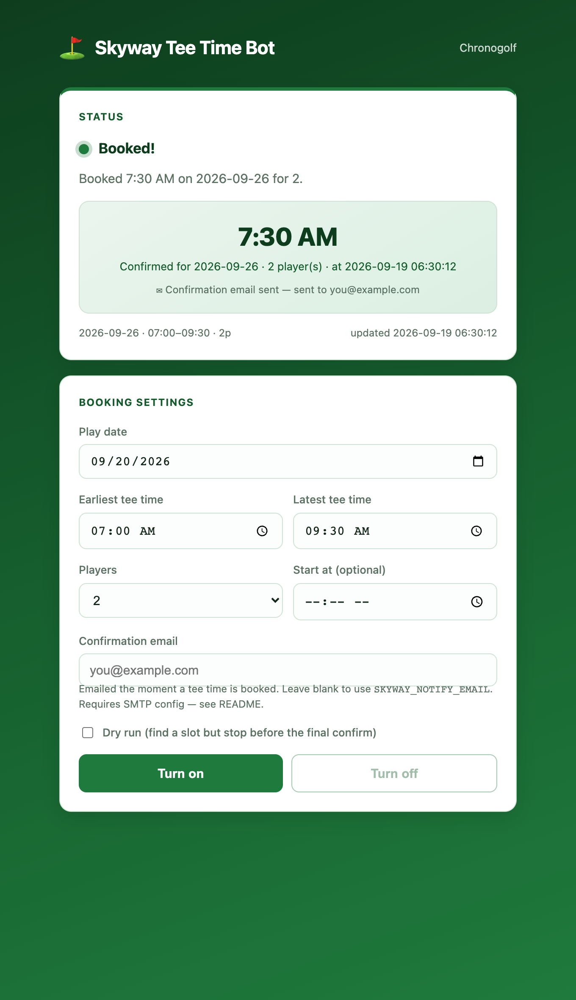

# ⛳ Skyway Tee Time Bot

> Automatically books tee times at Skyway Golf Course (Chronogolf / Lightspeed)
> the instant a slot opens — with a live web control panel and email confirmations.

<p align="center">
  
  
  
  
</p>

Popular tee times get booked in seconds and freed up just as unpredictably when
players cancel. This tool watches the tee sheet for you, grabs the first slot in
your window, and emails you the confirmation — so you don't have to sit refreshing
the page at 7 a.m.

<p align="center">
  
</p>

---

## Features

- **🎯 Targeted watching** — polls the tee sheet for openings inside your date,
  time window, and party size, and books the earliest match.
- **🖥️ Web control panel** — turn the bot on/off and watch live status
  (*searching → found → booked*) from a clean single-page UI. No build step.
- **✉️ Email confirmations** — get an email the moment a booking succeeds, sent
  by the bot itself so it arrives even if the panel is closed.
- **🛡️ Cloudflare-aware** — drives your real Google Chrome with automation
  fingerprints stripped, so the site sees a normal browser.
- **🤫 Human-like pacing** — randomized poll intervals and click delays instead
  of robotic fixed timing (see [Responsible use](#responsible-use)).
- **🧪 Dry-run mode** — find and stage a booking but stop before the final
  confirm, so you can watch the whole flow safely.
- **📸 Screenshotted flow** — every booking step is saved to disk for an audit
  trail if anything goes sideways.

## How it works

```
┌──────────────┐        ┌──────────────┐        ┌────────────────────┐
│  index.html  │  HTTP  │  server.py   │ spawns │   skyway_bot.py    │
│ control panel│◀──────▶│  (stdlib)    │───────▶│  (Playwright)      │
│              │  JSON  │  start/stop  │        │  watch → book      │
└──────────────┘        └──────┬───────┘        └─────────┬──────────┘
       ▲                       │  reads/writes            │ writes
       │      polls status     ▼                          ▼
       └───────────────  status.json  ◀──────────  live state + result
```

- **`skyway_bot.py`** reads availability from the JSON the tee-sheet page fetches
  itself (any response with `teetime` in the URL), so it doesn't depend on
  brittle page markup. Booking is done by clicking through the real UI.
- **`server.py`** is a dependency-free control plane: it starts/stops the bot as
  a subprocess and exposes `/api/status`, `/api/start`, `/api/stop`.
- **`index.html`** polls `/api/status` and renders the live state, including a
  confirmation card when a tee time is booked.

## Tech stack

| Layer     | Choice                          | Why                                        |
|-----------|---------------------------------|--------------------------------------------|
| Automation| **Playwright** + real Chrome    | Reliable browser control that evades bot detection |
| Backend   | **Python stdlib** `http.server` | Zero-install control panel                 |
| Frontend  | **Vanilla HTML/CSS/JS**         | No build tooling; a single self-contained file |
| Notifications | **smtplib** (Gmail SMTP)    | Confirmation email with no third-party service |

## Getting started

### 1. Install

```bash
git clone https://github.com/mylesai25/tee-time-bot.git
cd tee-time-bot

python3 -m venv .venv
.venv/bin/python -m pip install -r requirements.txt
.venv/bin/python -m playwright install chromium
```

### 2. Log in once

```bash
.venv/bin/python skyway_bot.py --login
```

A real Google Chrome window opens. Solve any Cloudflare check, log in to
Chronogolf, then press Enter in the terminal — the session is saved to
`~/.skyway_bot_profile` and reused for every run. Skyway is *reserve now, pay
later*, so no card details are involved.

### 3. Configure email (optional)

```bash
cp .env.example .env      # then fill in your values
```

`.env` is gitignored. For Gmail you'll need an **App Password** (Google Account
→ Security → 2-Step Verification → App passwords — a normal password won't work
with SMTP). Both the bot and the panel load `.env` automatically.

### 4. Run the control panel

```bash
.venv/bin/python server.py     # open http://localhost:8000
```

Pick your date, time window, and party size, then **Turn on**. The status card
updates every few seconds and shows the confirmed tee time once booked.

## Command-line usage

The bot runs standalone too:

```bash
# Watch, but stop before the final confirm (do this first):
.venv/bin/python skyway_bot.py --date 2026-09-26 --earliest 07:00 --latest 09:30 \
    --players 2 --dry-run

# Watch for cancellations and grab the first match:
.venv/bin/python skyway_bot.py --date 2026-09-26 --earliest 07:00 --latest 09:30 --players 2

# Sit idle until the booking window opens, then go, and email a confirmation:
.venv/bin/python skyway_bot.py --date 2026-09-26 --earliest 07:00 --latest 09:30 \
    --players 4 --start-at 19:00 --notify-email you@example.com
```

| Flag            | Description                                              |
|-----------------|----------------------------------------------------------|
| `--date`        | Play date, `YYYY-MM-DD` (required)                       |
| `--earliest` / `--latest` | Tee-time window, `HH:MM` (24-hour)            |
| `--players`     | Party size, 1–4                                          |
| `--start-at`    | Wait until this local time before starting               |
| `--poll`        | Base seconds between checks (jittered; floor 20s)        |
| `--max-minutes` | Give up after this long                                  |
| `--dry-run`     | Stop before the final confirm click                      |
| `--notify-email`| Send a confirmation email here                           |
| `--channel`     | Browser channel (default: real Chrome → bundled Chromium)|

## Responsible use

This is a **personal-use** tool for booking your own tee times. It's built to be
a considerate client rather than to hammer the service:

- Randomized poll intervals and click delays (no robotic fixed timing).
- A minimum 20-second poll floor.
- Bounded run windows via `--start-at` and `--max-minutes`.

Automating a booking site may conflict with its Terms of Service. Use a single
account, keep request volumes reasonable, and don't rely on it for anything you
aren't prepared to do by hand. You are responsible for how you use it.

## Project structure

```
tee-time-bot/
├── skyway_bot.py     # the bot: watch availability + book (Playwright)
├── server.py         # stdlib web server / control plane
├── index.html        # single-page control panel
├── requirements.txt  # Python dependencies (Playwright)
├── .env.example      # template for email/SMTP config
└── assets/           # README screenshot
```

## License

[MIT](LICENSE) © Myles Ingram
